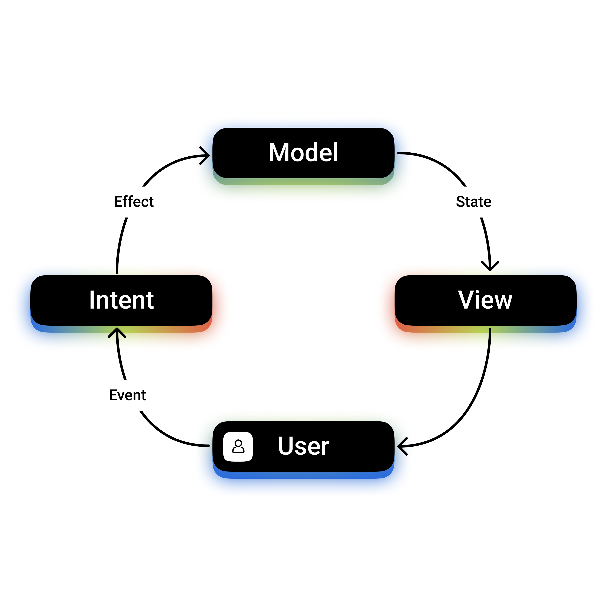

## MVI ANDROID by Coroutine



### MVI ANDROID by Coroutine based on MVICore.

### Main Feature:
1. State - your main sate class. The state change is determined in the implementation of the function ```suspend fun reduceState(currentState: State, effect: Effect): State``` depending on incoming events or effects.
2. Event - sealed class of all events occurring in your feature. Events are routed by calling a function ```fun sendEvent(event: Event)```.
3. Effect - sealed class implements intermediate states coming to the input of the reducer for subsequent state changes. Effects are important for subsequent implementation PostProcessor and News.
4. News - sealed class can use to notify about individual events. For example, a toast/snackbar message or a redirect event.
5. PostProcessor determines in the redefinition of the function ```fun postProcessor(effect: Effect): Event?``` the generation of a new event (if necessary) in the form of a reaction to the necessary effect in order to create a new state.
6. Bootstrapper is called immediately after creation and executes the events specified to it.

### All you need to start is to copy the **mvi** library from the repository to your project.
